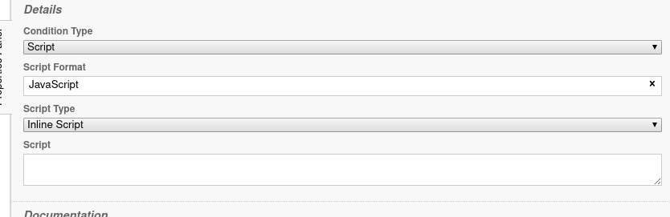

# Camunda Modeler Script Box Height Plugin

## Description

The script box for inline scripts is only 2 lines high. You can manually increase the height of the box but if you then select a different task and return the script box has resized back to 2 lines again. This can mean a lot of resizing script boxes.

This plugin improves that by setting a bigger script box height by default.

## Installation

1. Clone this repo into the `plugins` directory of Camunda Modeler
2. Restart Camunda Modeler
